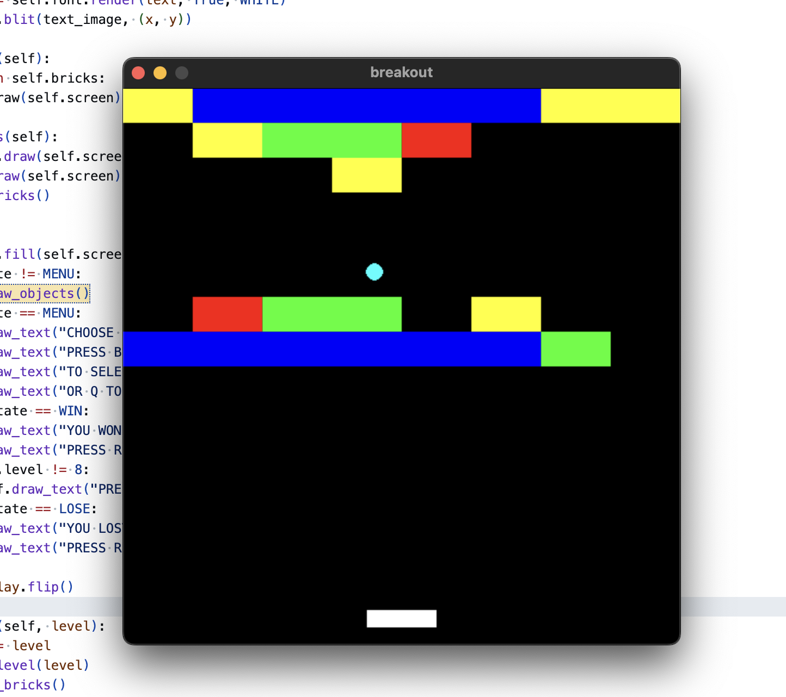

# Breakout (Pygame)



A classic Breakout game written in Python using Pygame.

This project was created to practice object-oriented programming, game loops, delta time movement, collision detection, and basic game architecture.

## Features

- Classic Breakout gameplay with 8 handcrafted levels
- Brick durability system (1–4 hits) with color coding
- Dynamic ball reflection from the paddle (paddle movement affects ball angle)
- Precise collision resolution using previous-frame tracking
- Level selection menu
- Delta time based movement

## Controls

| Key | Action |
|-----|--------|
| ← | Move Paddle Left |
| → | Move Paddle Right |
| **1–8** | Select Level (from the menu) |
| **N** | Next Level (after winning) |
| **R** | Return to Level Selection |
| **Q** | Quit |

## Brick Types & Durability

Bricks are color-coded based on how many hits they can take before breaking:

- 🔴 **Red** – 1 hit
- 🟡 **Yellow** – 2 hits
- 🟢 **Green** – 3 hits
- 🔵 **Blue** – 4 hits

## Handcrafted Levels

The game features 8 unique level designs:
1. Chessboard
2. Pyramid
3. Columns
4. Invader
5. Fortress
6. Hourglass
7. Maze
8. Final Challenge

## Project Structure

```
project/
│
├── breakout.py
├── config.py
├── levels.py
├── objects.py
└── README.md
```

## Architecture

The project is built around the following files:

- **breakout.py** – Manages the main game loop, updates positions, handles state transitions (`MENU`, `PLAYING`, `WIN`, `LOSE`), and implements the collision detection system.
- **objects.py** – Contains class definitions for game objects:
  - `Paddle`: Moves left/right, bounds to screen limits, and influences ball bounce direction.
  - `Ball`: Bounces off walls, paddle, and bricks, tracking its previous-frame position for accurate collision resolution.
  - `Brick`: Tracks hits remaining and handles rendering its active color state.
- **levels.py** – Defines levels as 8x8 matrices, where numbers `0–4` dictate space and brick types.
- **config.py** – Stores constants such as screen resolution, colors, frames per second (FPS), and state IDs.

## Installation

```bash
pip install pygame
```

## Running the game

```bash
python breakout.py
```
